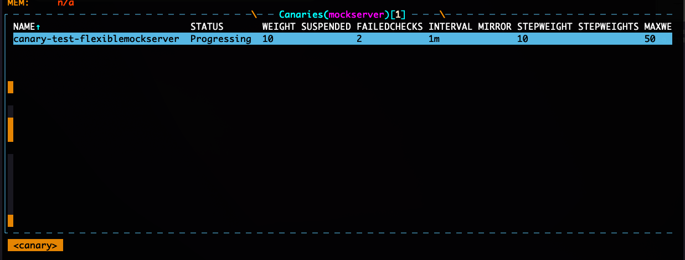
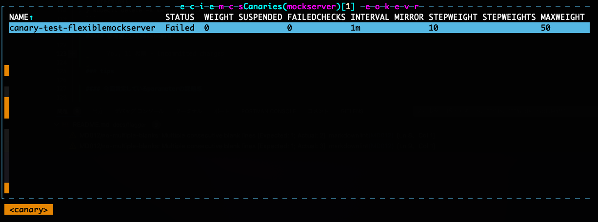
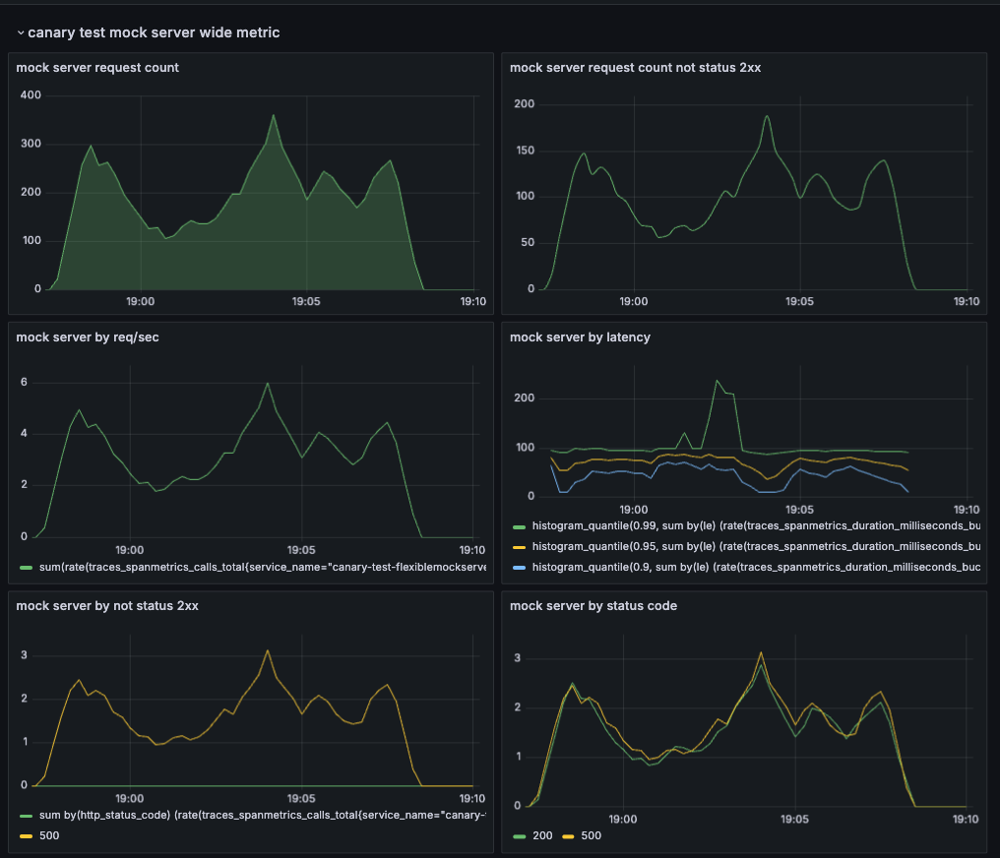

# progressive deliveryの動きを確認してみる(Flagger編)

## 概要

このページではprogressive deliveryの動きを目で見て確認しようというものになります。
このドキュメントでは、Flaggerをベースに解説します。


## 前提

Flaggerの動作確認はistioをベースに動作させます。

> [!NOTE]
> こちらのドキュメントを参考に全ての手順を踏んでから実施してください。(サービスメッシュの概要)
> <br> ref: [link](../README.md)

## progressive deliveryとは？

TBU

ref: [link](https://docs.flagger.app/usage/deployment-strategies#canary-release)

### flaggerのInstall

```:terminal
❯ kubectl apply -k sample_manifest/kubernetes/flagger/
```

ref: [link](https://docs.flagger.app/usage/deployment-strategies#canary-release)

### flaggerを動作確認するためのmock serverを用意する

```:terminal
❯ kubectl apply -f https://raw.githubusercontent.com/fluxcd/flagger/main/artifacts/flagger/crd.yaml
```

```:terminal
❯ kubectl apply -k sample_manifest/kubernetes/flagger/canary-test-flexiblemockserver
```

### 実際に動作させてみよう

#### 成功パターン

labelに差分を入れて、動作を確認してみる。

```:terminal
TBU
```

```:terminal
❯ kubectl apply -k sample_manifest/kubernetes/flagger/canary-test-flexiblemockserver
```

実際にapplicationが実行されたら、負荷試験ツールを用いてリクエストを流してみる。

```:terminal
❯ kubectl apply -k sample_manifest/kubernetes/locust/sample/
```

開始

```:terminal

```

実行中

```:terminal

```

終了

```:terminal

```

試験が終わったら`locust`を削除しましょう。

```:terminal
❯ kubectl delete -k sample_manifest/kubernetes/locust/sample/
```

#### 失敗パターン

```:terminal
❯ kubectl apply -k sample_manifest/kubernetes/locust/sample2/
```

##### 開始


##### 実行中



今回はk9sの画面を表示していますが、`SUSPENDED`の数が増えていることがわかります。
これは、metric_templateで定義した値がcanaryで設定してる閾値を満たしていないまたは、超えているためです。

##### 失敗



今回はk9sの画面を表示していますが、`SUSPENDED`の数が設定している数を超えたため失敗したことがわかります。

イベントは以下のように表示されています。

```:terminal
  Warning  Synced  10m                  flagger  Halt canary-test-flexiblemockserver.mockserver advancement my metric 91.57 > 10
  Warning  Synced  9m38s                flagger  Halt canary-test-flexiblemockserver.mockserver advancement my metric 133.65 > 10
  Warning  Synced  8m24s                flagger  Halt canary-test-flexiblemockserver.mockserver advancement my metric 74.69 > 10
  Warning  Synced  7m38s                flagger  Halt canary-test-flexiblemockserver.mockserver advancement my metric 55.80 > 10
  Warning  Synced  6m38s                flagger  Halt canary-test-flexiblemockserver.mockserver advancement my metric 65.24 > 10
  Warning  Synced  5m38s                flagger  Halt canary-test-flexiblemockserver.mockserver advancement my metric 91.61 > 10
  Warning  Synced  4m38s                flagger  Halt canary-test-flexiblemockserver.mockserver advancement my metric 170.53 > 10
  Warning  Synced  3m38s                flagger  Halt canary-test-flexiblemockserver.mockserver advancement my metric 94.74 > 10
  Warning  Synced  38s (x4 over 2m38s)  flagger  (combined from similar events): Canary failed! Scaling down canary-test-flexiblemockserver.mockserver
```

試験が終わったら`locust`を削除しましょう。

```:terminal
❯ kubectl delete -k sample_manifest/kubernetes/locust/sample2/
```

##### 参考値としてdashboard



### tips

#### 今回設定しているparameterの課題感

TBU

#### metric周りのtips

TBU
