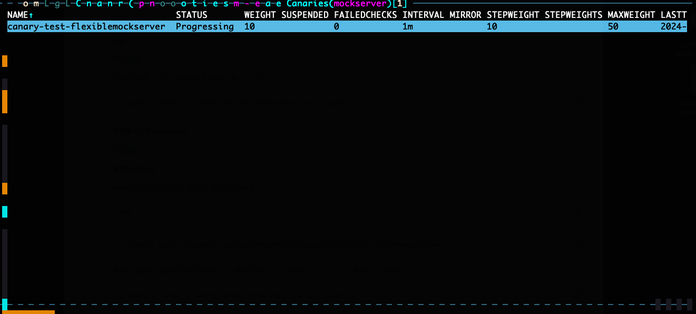
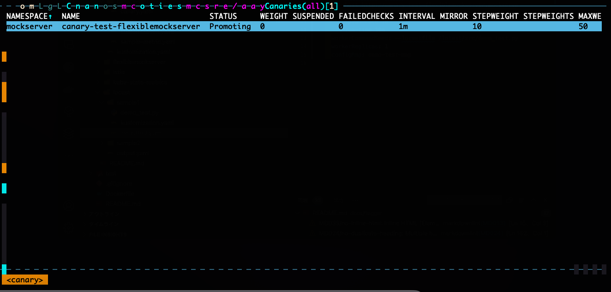
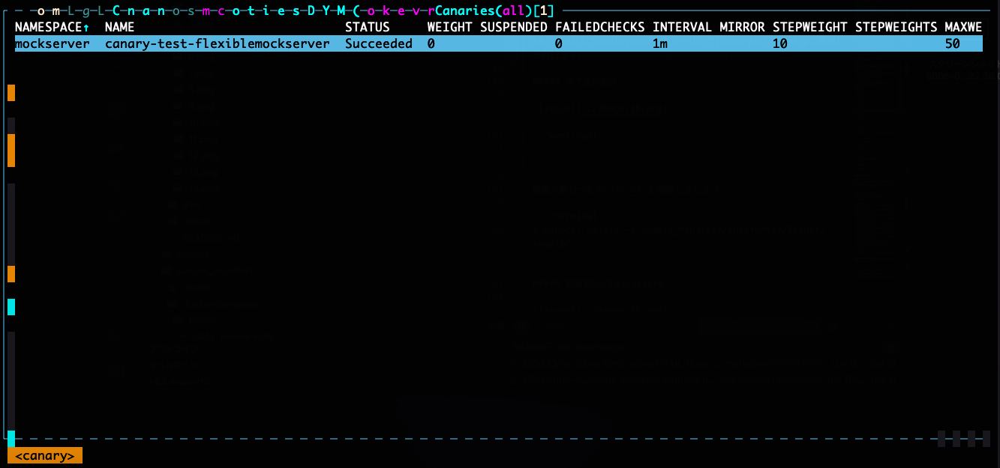
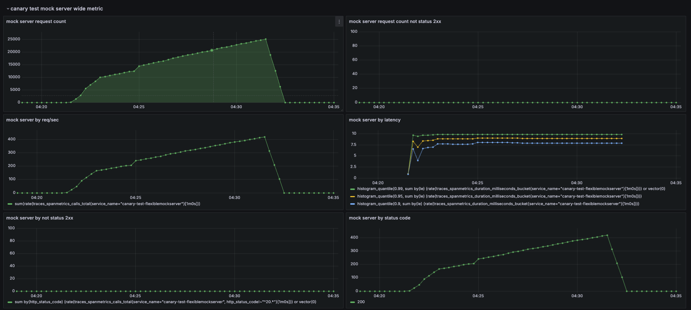

# progressive deliveryの動きを確認してみる(Flagger編)

## 概要

このページではprogressive deliveryの動きを目で見て確認しようというものになります。

※ このドキュメントでは、progressive delivery = canary releaseのことを指しています。

## 前提

Flaggerの動作確認はistioをベースに動作させます。

> [!NOTE]
> こちらのドキュメントを参考に全ての手順を踏んでから実施してください。(サービスメッシュの概要)
> <br> ref: [link](../README.md)

> [!NOTE]
> このドキュメントで負荷試験ツールを利用する場合には、locustをinstallする必要があります。
> <br> ref: [link](../locust/README.md)

## そもそもFlaggerをどう理解すれば良いのか？

Flaggerは、IstioなどのService Meshツールと連携してCanaryリリースやブルー/グリーンデプロイメントといったprogressive deliveryの自動化を実現するオペレーターです。Istioを例にあげると、Flaggerは指定されたアプリケーションに基づいて、Service、VirtualService、DestinationRuleなどのIstioリソースを自動生成します。このプロセスは、resource:canaryに基づいて行われ、アプリケーションのリリース管理が簡素化されます。

progressive deliveryが開始されると、Flaggerは事前に定義されたMetricTemplateを使用して、各モニタリングプロバイダー（PrometheusやDatadogなど）にクエリを送信し、リリースの健全性を監視します。モニタリングの結果に基づいて、問題がなければIstioのweightを調整し、トラフィックの割合を段階的にCanary環境へ移行させます。万が一、異常が検知された場合は、リリースを自動的に停止またはロールバックします。

※ これは個人的な考え方なので、もっと良い表現の仕方があったら教えてください...

※後で図を入れる。

## Flaggerにおけるprogressive deliveryとは？

> progressive deliveryが開始されると、Flaggerは事前に定義されたMetricTemplateを使用して、各モニタリングプロバイダー（PrometheusやDatadogなど）にクエリを送信し、リリースの健全性を監視します。モニタリングの結果に基づいて、問題がなければIstioのweightを調整し、トラフィックの割合を段階的にCanary環境へ移行させます。万が一、異常が検知された場合は、リリースを自動的に停止またはロールバックします。

ここについてさらに詳細に解説します。

TBU

ref: [link](https://docs.flagger.app/usage/deployment-strategies#canary-release)

### flaggerのInstall

```:terminal
❯ kubectl apply -k sample_manifest/kubernetes/flagger/
```

ref: [link](https://docs.flagger.app/usage/deployment-strategies#canary-release)

### flaggerを動作確認するためのmock serverを用意する

```:terminal
❯ kubectl apply -f https://raw.githubusercontent.com/fluxcd/flagger/main/artifacts/flagger/crd.yaml
```

```:terminal
❯ kubectl apply -k sample_manifest/kubernetes/flagger/canary-test-flexiblemockserver
```

### Resourceのschema解説

TBU

## 実際に動作させてみよう

### 成功パターン

labelに差分を入れて、動作を確認してみる。

```:terminal
TBU
```

```:terminal
❯ kubectl apply -k sample_manifest/kubernetes/flagger/canary-test-flexiblemockserver
```

実際にapplicationが実行されたら、負荷試験ツールを用いてリクエストを流してみる。

```:terminal
❯ kubectl apply -k sample_manifest/kubernetes/locust/sample/
```

#### 実行中



実行されると、weightがあがります。

ここのweightはistioのweightと一致しています。

```yaml:yaml
apiVersion: networking.istio.io/v1beta1
kind: VirtualService
metadata:
  annotations:
    helm.toolkit.fluxcd.io/driftDetection: disabled
    kustomize.toolkit.fluxcd.io/reconcile: disabled
  creationTimestamp: "2024-09-25T05:11:56Z"
  generation: 28
  name: canary-test-flexiblemockserver
  namespace: mockserver
  ownerReferences:
  - apiVersion: flagger.app/v1beta1
    blockOwnerDeletion: true
    controller: true
    kind: Canary
    name: canary-test-flexiblemockserver
    uid: 83ec2230-110d-4f02-98fe-ecd6f07b9b82
  resourceVersion: "583895"
  uid: efa1d284-9c2c-4c41-844f-be07387e789e
spec:
  gateways:
  - mesh
  hosts:
  - canary-test-flexiblemockserver
  http:
  - route:
    - destination:
        host: canary-test-flexiblemockserver-primary
      weight: 90
    - destination:
        host: canary-test-flexiblemockserver-canary
      weight: 10
```

#### Progressive Delivery完了



```yaml:yaml
apiVersion: networking.istio.io/v1beta1
kind: VirtualService
metadata:
  annotations:
    helm.toolkit.fluxcd.io/driftDetection: disabled
    kustomize.toolkit.fluxcd.io/reconcile: disabled
  creationTimestamp: "2024-09-25T05:11:56Z"
  generation: 38
  name: canary-test-flexiblemockserver
  namespace: mockserver
  ownerReferences:
  - apiVersion: flagger.app/v1beta1
    blockOwnerDeletion: true
    controller: true
    kind: Canary
    name: canary-test-flexiblemockserver
    uid: 83ec2230-110d-4f02-98fe-ecd6f07b9b82
  resourceVersion: "587738"
  uid: efa1d284-9c2c-4c41-844f-be07387e789e
spec:
  gateways:
  - mesh
  hosts:
  - canary-test-flexiblemockserver
  http:
  - route:
    - destination:
        host: canary-test-flexiblemockserver-primary
      weight: 50
    - destination:
        host: canary-test-flexiblemockserver-canary
      weight: 50
```

promoteフェイズになると、VirtualServiceをcanary:primaryを50:5050にしてDeploymentのミラーリング(canaryからprimaryに昇格)を行います。

#### 完了後の動き



```yaml:yaml
apiVersion: networking.istio.io/v1beta1
kind: VirtualService
metadata:
  annotations:
    helm.toolkit.fluxcd.io/driftDetection: disabled
    kustomize.toolkit.fluxcd.io/reconcile: disabled
  creationTimestamp: "2024-09-25T05:11:56Z"
  generation: 39
  name: canary-test-flexiblemockserver
  namespace: mockserver
  ownerReferences:
  - apiVersion: flagger.app/v1beta1
    blockOwnerDeletion: true
    controller: true
    kind: Canary
    name: canary-test-flexiblemockserver
    uid: 83ec2230-110d-4f02-98fe-ecd6f07b9b82
  resourceVersion: "588295"
  uid: efa1d284-9c2c-4c41-844f-be07387e789e
spec:
  gateways:
  - mesh
  hosts:
  - canary-test-flexiblemockserver
  http:
  - route:
    - destination:
        host: canary-test-flexiblemockserver-primary
      weight: 100
    - destination:
        host: canary-test-flexiblemockserver-canary
      weight: 0
```

canaryからprimaryにミラーリングを完了させると、VirtualServiceのweightをcanary:primaryを0:100にしてProgressiveDeliveryを完了させます。

eventも載せておきます。
```:terminal
Events:
  Type     Reason  Age                  From     Message
  ----     ------  ----                 ----     -------
  Normal   Synced  9m38s (x7 over 8h)   flagger  Starting canary analysis for canary-test-flexiblemockserver.mockserver
  Normal   Synced  9m38s (x6 over 8h)   flagger  Advance canary-test-flexiblemockserver.mockserver canary weight 10
  Normal   Synced  8m38s (x6 over 8h)   flagger  Advance canary-test-flexiblemockserver.mockserver canary weight 20
  Normal   Synced  7m38s (x6 over 8h)   flagger  Advance canary-test-flexiblemockserver.mockserver canary weight 30
  Normal   Synced  6m38s (x6 over 8h)   flagger  Advance canary-test-flexiblemockserver.mockserver canary weight 40
  Normal   Synced  5m38s (x5 over 8h)   flagger  Advance canary-test-flexiblemockserver.mockserver canary weight 50
  Normal   Synced  2m39s (x12 over 8h)  flagger  (combined from similar events): Promotion completed! Scaling down canary-test-flexiblemockserver.mockserver
```

試験が終わったら`locust`を削除しましょう。

```:terminal
❯ kubectl delete -k sample_manifest/kubernetes/locust/sample/
```

#### 参考値としてdashboard



### 失敗パターン

labelに差分を入れて、動作を確認してみる。

```:terminal
TBU
```

```:terminal
❯ kubectl apply -k sample_manifest/kubernetes/flagger/canary-test-flexiblemockserver
```

実際にcanary podが実行されたら、負荷試験ツールを用いてリクエストを流してみる。

```:terminal
❯ kubectl apply -k sample_manifest/kubernetes/locust/sample2/
```

#### 実行中


今回はk9sの画面を表示していますが、`SUSPENDED`の数が増えていることがわかります。
これは、metric_templateで定義した値がcanaryで設定してる閾値を満たしていないまたは、超えているためです。

#### 失敗


今回はk9sの画面を表示していますが、`SUSPENDED`の数が設定している数を超えたため失敗したことがわかります。

イベントは以下のように表示されています。

```:terminal
  Warning  Synced  10m                  flagger  Halt canary-test-flexiblemockserver.mockserver advancement my metric 91.57 > 10
  Warning  Synced  9m38s                flagger  Halt canary-test-flexiblemockserver.mockserver advancement my metric 133.65 > 10
  Warning  Synced  8m24s                flagger  Halt canary-test-flexiblemockserver.mockserver advancement my metric 74.69 > 10
  Warning  Synced  7m38s                flagger  Halt canary-test-flexiblemockserver.mockserver advancement my metric 55.80 > 10
  Warning  Synced  6m38s                flagger  Halt canary-test-flexiblemockserver.mockserver advancement my metric 65.24 > 10
  Warning  Synced  5m38s                flagger  Halt canary-test-flexiblemockserver.mockserver advancement my metric 91.61 > 10
  Warning  Synced  4m38s                flagger  Halt canary-test-flexiblemockserver.mockserver advancement my metric 170.53 > 10
  Warning  Synced  3m38s                flagger  Halt canary-test-flexiblemockserver.mockserver advancement my metric 94.74 > 10
  Warning  Synced  38s (x4 over 2m38s)  flagger  (combined from similar events): Canary failed! Scaling down canary-test-flexiblemockserver.mockserver
```

試験が終わったら`locust`を削除しましょう。

```:terminal
❯ kubectl delete -k sample_manifest/kubernetes/locust/sample2/
```

#### 参考値としてdashboard


### tips

#### metric周りのtips

##### canaryとprimaryのmetricを分ける

##### flaggerが提供しているmetricを活用する

