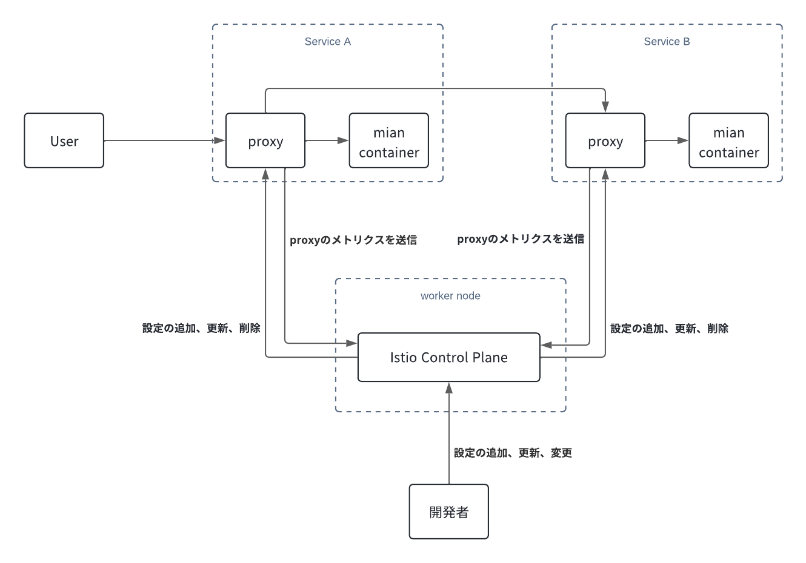
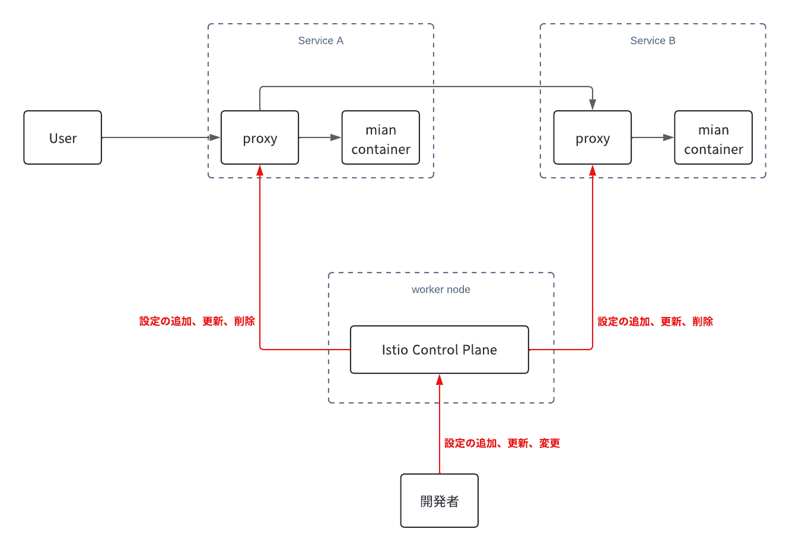
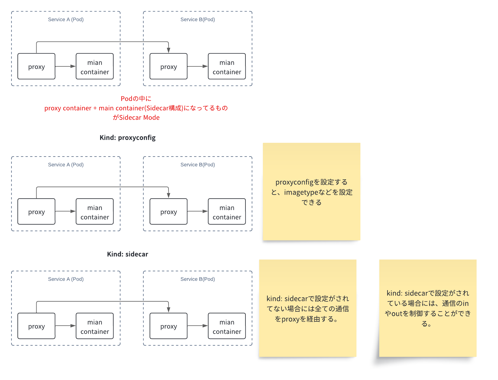

# istio sandbox

## Istioとは？

istioとは、ざっくり説明すると数あるサービスメッシュツールのうちの1つです。

公式のサイトには、以下のように書かれています。

サービスメッシュは、アプリケーションにゼロトラストセキュリティ、可観測性、高度なトラフィック管理などの機能をコード変更なしで提供するインフラストラクチャ層です。Istioは最も人気があり、強力で信頼されているサービスメッシュです。Istioは2016年にGoogle、IBM、Lyftによって設立され、KubernetesやPrometheusのようなプロジェクトと並んでCloud Native Computing Foundationの卒業プロジェクトです。

> A service mesh is an infrastructure layer that gives applications capabilities like zero-trust security, observability, and advanced traffic management, without code changes. Istio is the most popular, powerful, and trusted service mesh. Founded by Google, IBM and Lyft in 2016, Istio is a graduated project in the Cloud Native Computing Foundation alongside projects like Kubernetes and Prometheus.

ref: [The Istio service mesh](https://istio.io/latest/about/service-mesh/#what-is-istio)

ref: [The Istio service mesh](https://istio.io/latest/about/service-mesh/)

サービスメッシュの該当でも解説したことと重複するところもありますが、
Istioは、Istio Control Planeによって通信の設定が追加、更新、削除されると、連携しているプロキシ設定を注入することができます。

また、Istio Control Planeは通信制御の設定の注入だけでなく、証明書管理やトラフィックの監視も行います。

これにより、Istioはマイクロサービス間の通信を効率的かつセキュアに管理することができます。

### もう少しわかりやすく図を書くと

#### Discovery

Istioが有効化された状態でかつ、proxyがServiceに導入されることが有効化された状態で新規サービスをKubernetes上に構築すると、Istio Control Planeによって新しいサービスに自動的にProxyが注入されます。

ref: [Use discovery selectors to configure namespaces for your Istio service mesh](https://istio.io/latest/blog/2021/discovery-selectors/)

#### Configuration

開発者がサービスメッシュに関係する設定をapplyすると、Istio Control Planeがクラスター内に無数にあるproxyに対して、設定を追加、更新、削除を行います。

#### Certificates

自分もあまりIstioのcertificatesの部分について詳しくはないのでこのドキュメントあたりが参考になると思うので貼っておきます。

ref: [Security](https://istio.io/latest/docs/concepts/security/)

## Istioで提供されるProxyについて

Istioで提供されるProxyはEnvoyをベースに作られています。

ドキュメントには以下のように書かれています。

最初から、IstioはLyftによって初めて構築された高性能サービスプロキシであるEnvoyプロキシによって駆動されてきました。IstioはEnvoyを採用した最初のプロジェクトであり、Istioチームは最初の外部コミッターでした。Envoyはその後、Google Cloudを支えるロードバランサーおよびほぼすべての他のサービスメッシュプラットフォームのプロキシとなりました。

Istioは、Envoyのすべてのパワーと柔軟性を引き継ぎ、Istioチームによって開発されたWebAssemblyを使用した世界クラスの拡張性を備えています。

> From the beginning, Istio has been powered by the Envoy proxy, a high performance service proxy initially built by Lyft. Istio was the first project to adopt Envoy, and the Istio team were the first external committers. Envoy would go on to become the load balancer that powers Google Cloud as well as the proxy for almost every other service mesh platform.
Istio inherits all the power and flexibility of Envoy, including world-class extensibility using WebAssembly that was developed in Envoy by the Istio team.

ref: [The Envoy proxy](https://istio.io/latest/docs/overview/why-choose-istio/#envoy)

基本的にIstioとはEnvoyの設定を抽象化したものであり、開発者がEnvoyのconfigを簡略化されたマニフェスト(GatewayAPIやVirtualService、DestinationRule、ServiceEntryなど...)を書いてそれをKubernetes clusterにapplyすると、それをIstio Control Planeが解釈してProxy(Envoy)に設定を注入します。

なので、IstioにおけるProxy(Istio-Proxy)とはすなわちEnvoyだと思っていただいて問題ないと思います。

## Istioで提供されるproxyモードについて

### サイドカーモード

ドキュメントには以下のように書かれています。

クラスター内で起動する各ポッドと一緒にEnvoyプロキシが展開されるか、またはVM上で稼働するサービスの横で実行されます。

> which deploys an Envoy proxy along with each pod that you start in your cluster, or running alongside services running on VMs.

ref: [How it works(sidecar mode)](https://istio.io/latest/docs/overview/what-is-istio/#how-it-works)

### アンビエントモード

ドキュメントには以下のように書かれています。

各ノードにLayer 4プロキシを使用し、オプションで各ネームスペースにLayer 7機能を持つEnvoyプロキシを使用します。

> which uses a per-node Layer 4 proxy, and optionally a per-namespace Envoy proxy for Layer 7 features.

ref: [How it works(ambient mode)](https://istio.io/latest/docs/overview/what-is-istio/#how-it-works)

#### 補足の解説

##### サイドカー

###### サイドカーモードとは何か？

サイドカーモードとは、ProxyをKubenretesのPodのサイドカーとして稼働させる方式のことです。

###### サイドカーの導入について

ドキュメントには以下のように書かれています。

サイドカーは、Istioが提供する変換Webhookアドミッションコントローラーを使用して、適用可能なKubernetesポッドに自動的に追加されます。

> Sidecars can be automatically added to applicable Kubernetes pods using a mutating webhook admission controller provided by Istio.

ref: [Installing the Sidecar](https://istio.io/latest/docs/setup/additional-setup/sidecar-injection/)

###### proxyの構成設定について

ドキュメントには以下のように書かれています。

ProxyConfigは、プロキシレベルの構成オプションを公開します。ProxyConfigは、ワークロードごと、ネームスペースごと、またはメッシュ全体で設定できます。ProxyConfigは必須のリソースではありません。各フィールドにインラインで記載されているデフォルト値があります。

注意: ProxyConfigのフィールドは動的に構成されるものではなく、変更を反映させるにはワークロードの再起動が必要です。

> ProxyConfig exposes proxy level configuration options. ProxyConfig can be configured on a per-workload basis, a per-namespace basis, or mesh-wide. ProxyConfig is not a required resource; there are default values in place, which are documented inline with each field.
>
> NOTE: fields in ProxyConfig are not dynamically configured - changes will require restart of workloads to take effect.

ref: [ProxyConfig](https://istio.io/latest/docs/reference/config/networking/proxy-config/)

###### Sidecarの通信制御について

ドキュメントには以下のように書かれています。

サイドカーは、アタッチされているワークロードインスタンスへのインバウンドおよびアウトバウンド通信を仲介するサイドカープロキシの設定を記述します。デフォルトでは、Istioはメッシュ内のすべてのサイドカープロキシを、メッシュ内のすべてのワークロードインスタンスに到達するために必要な設定と、ワークロードに関連するすべてのポートでトラフィックを受け入れるための設定でプログラムします。サイドカー設定は、プロキシがワークロードへのトラフィックを転送する際に受け入れるポートやプロトコルのセットを微調整する方法を提供します。さらに、ワークロードインスタンスからのアウトバウンドトラフィックを転送する際に、プロキシが到達できるサービスのセットを制限することも可能です。

> Sidecar describes the configuration of the sidecar proxy that mediates inbound and outbound communication to the workload instance it is attached to. By default, Istio will program all sidecar proxies in the mesh with the necessary configuration required to reach every workload instance in the mesh, as well as accept traffic on all the ports associated with the workload. The Sidecar configuration provides a way to fine tune the set of ports, protocols that the proxy will accept when forwarding traffic to and from the workload. In addition, it is possible to restrict the set of services that the proxy can reach when forwarding outbound traffic from workload instances.

ref: [Sidecar](https://istio.io/latest/docs/reference/config/networking/sidecar/)

上記で言ってることを図にすると以下のようになります。

###### サイドカーモードを図にすると

> [!TIP]
> アンビエントモードも下記で紹介でも解説されていますが、現状サイドカーモードがサポートされなくなるわけではありません。(2024/06/30現在)
> > Sidecars are not going away, and remain first-class citizens in Istio. You can continue to use sidecars, and they will remain fully supported. For any feature outside of the Alpha or Beta scope for ambient mode, you should consider using the sidecar mode until the feature is added to ambient mode. Some use cases, such as traffic shifting based on source labels, will continue to be best implemented using the sidecar mode. While we believe most use cases will be best served with a mesh in ambient mode, the Istio project remains committed to ongoing sidecar mode support. 
> > ref: [What about sidecars?](https://istio.io/latest/blog/2024/ambient-reaches-beta/#what-about-sidecars)

##### アンビエントモードとは何か？

> [!NOTE]
> アンビエントモードはv.1.22でベータ版に昇格してます。 
ref: [Say goodbye to your sidecars: Istio's ambient mode reaches Beta in v1.22](https://istio.io/latest/blog/2024/ambient-reaches-beta/)

TUB

## 各機能の検証

### 新方式　(現在開発中(移行前))

#### GatewayAPI

> [!NOTE]
> 2024/06/30現在GatewayAPIは以下のように書かれています。
> > * In Istio APIs, a Gateway configures an existing gateway Deployment/Service that has been deployed. In the Gateway APIs, the Gateway resource both configures and deploys a gateway. See Deployment Methods for more information.
> > * In the Istio VirtualService, all protocols are configured within a single resource. In the Gateway APIs, each protocol type has its own resource, such as HTTPRoute and TCPRoute.
> > * While the Gateway APIs offer a lot of rich routing functionality, it does not yet cover 100% of Istio’s feature set. Work is ongoing to extend the API to cover these use cases, as well as utilizing the APIs extensibility to better expose Istio functionality.

ref: [Differences from Istio APIs](https://istio.io/latest/docs/tasks/traffic-management/ingress/gateway-api/#differences-from-istio-apis)

[GatewayAPIの検証](./VirtualService/README.md)

### 現行　(現在の主流)

### kindを使って検証用Kubernetes クラスターを用意する

TUB

##### ServiceEntry

[ServiceEntryの検証](./ServiceEntry/README.md)

##### VirtualService

[VirtualServiceの検証](./VirtualService/README.md)

##### DestinationRule

[DestinationRuleの検証](./DestinationRule/README.md)

## 参考資料

[istio-sandbox](https://github.com/yokawasa/istio-sandbox)
