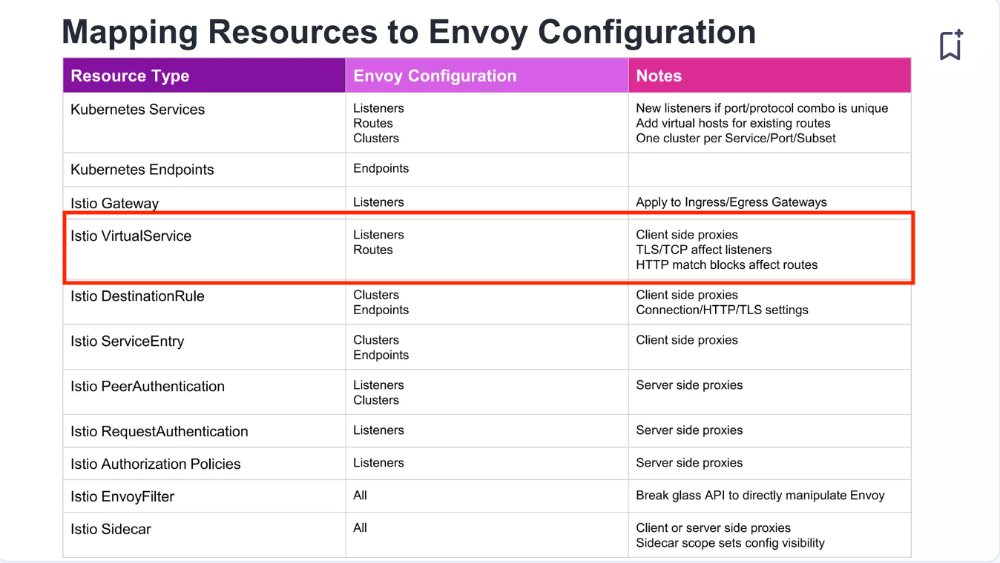

# VirtualServiceの検証

## VirtualServiceとは？

ドキュメントには以下のように書かれています。

トラフィックのルーティングに影響を与える設定。

> Configuration affecting traffic routing.

ref: [VirtualService](https://istio.io/latest/docs/reference/config/networking/virtual-service/#VirtualService)

## Envoyで言うと、VirtualServiceはなんの設定に当たるのか

ref: [Debugging Your Debugging Tools: What to do When Your Service Mesh Goes Down](https://www.slideshare.net/slideshow/debugging-your-debugging-tools-what-to-do-when-your-service-mesh-goes-down/237797183#19)

該当のスライドでも述べられていますが、VirtualServiceの設定で言うところの[listener](https://www.envoyproxy.io/docs/envoy/latest/configuration/listeners/listeners)と[route](https://www.envoyproxy.io/docs/envoy/latest/api-v3/http_routes/http_routes)に当たります。

## 検証

TUB
