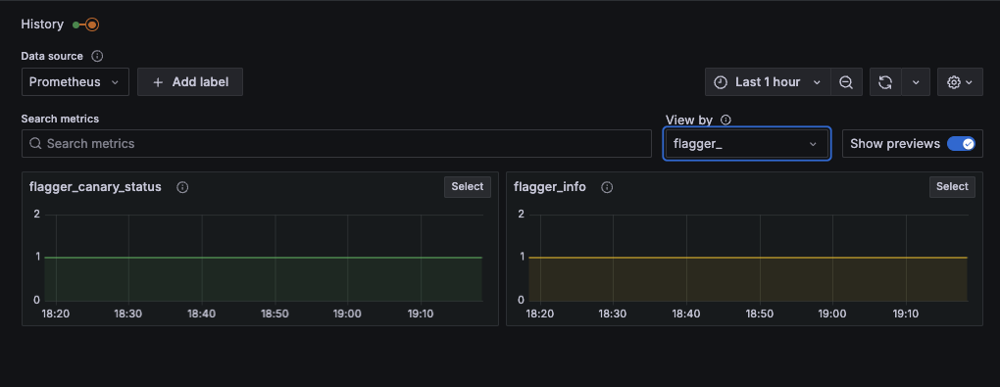
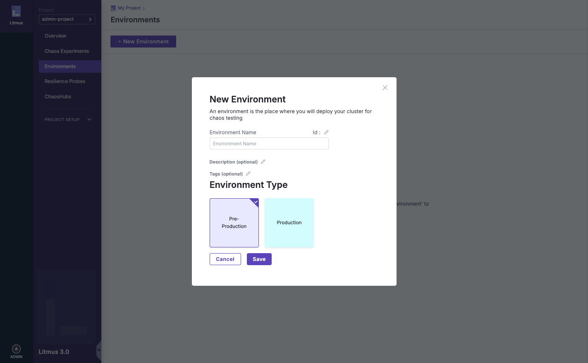
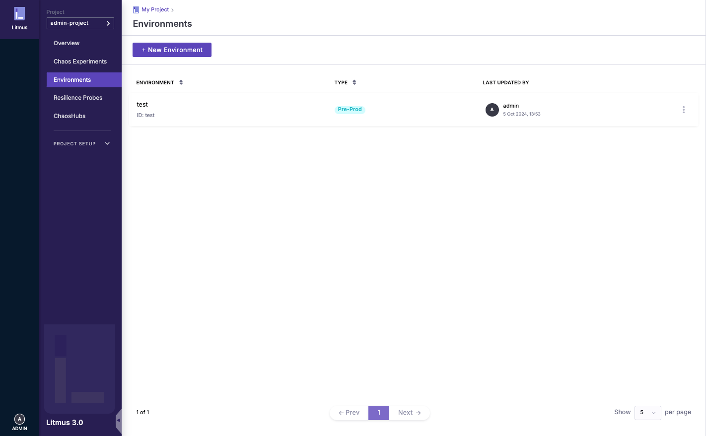
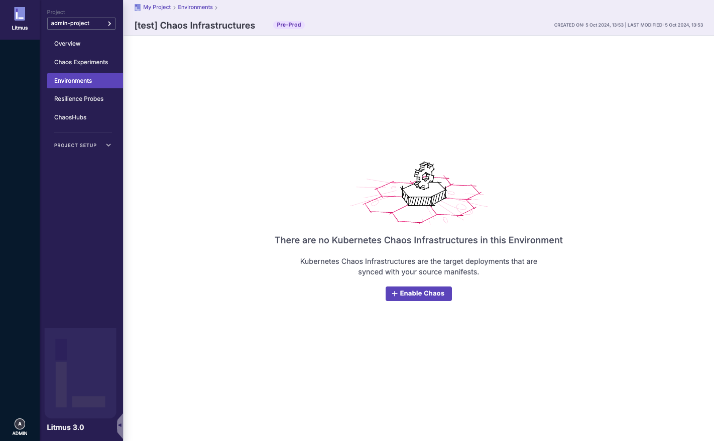
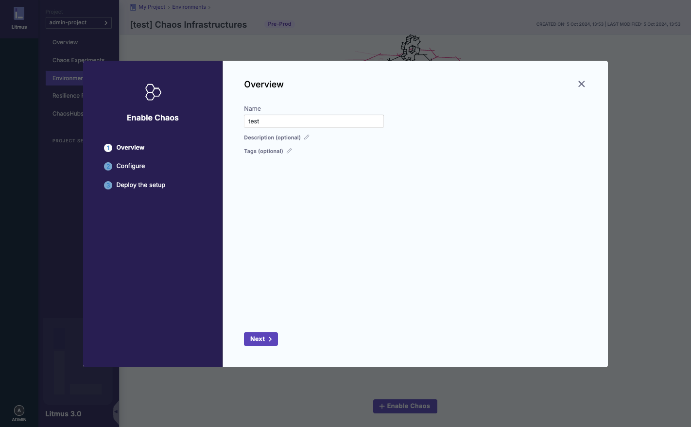
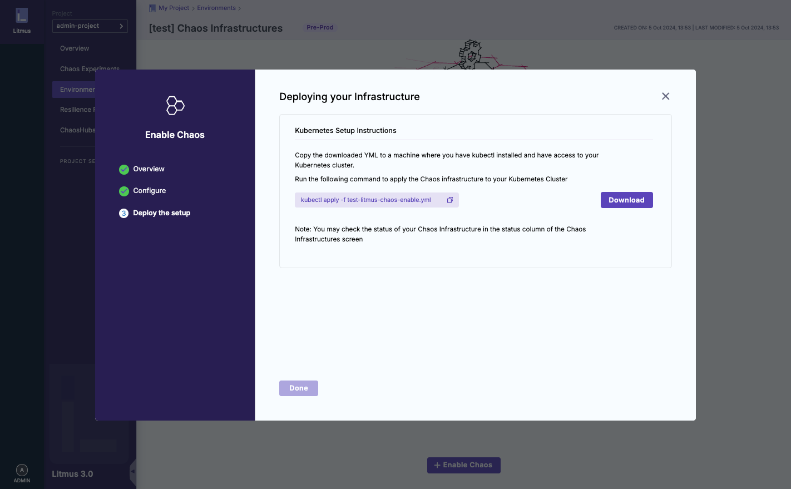

# introduction

## install

インストール方法

```:terminal
❯ kubectl apply -k sample_manifest/kubernetes/litmus
```

## litmusとは？

TBU

## 使い方

初期パスワードは、`id:admin` `pass:litmus` になります。
(画像を載せる)

### 事前準備













```:terminal
[kind-sandbox-test|default] :ctx
[arm64]⚡️
❯ kubectl apply -f test-litmus-chaos-enable.yml
```

## 実際に使ってみる

### control-planeに障害を起こしてみる

#### aaa

TBU

#### aaa1

TBU

#### aaa2

TBU

#### aaa3

TBU

### aaa4

TBU

### worker-nodeに障害を起こしてみる

#### aaa5

TBU

#### aaa6

TBU

#### aaa7

TBU

#### aaa8

TBU

### aaa9

TBU
