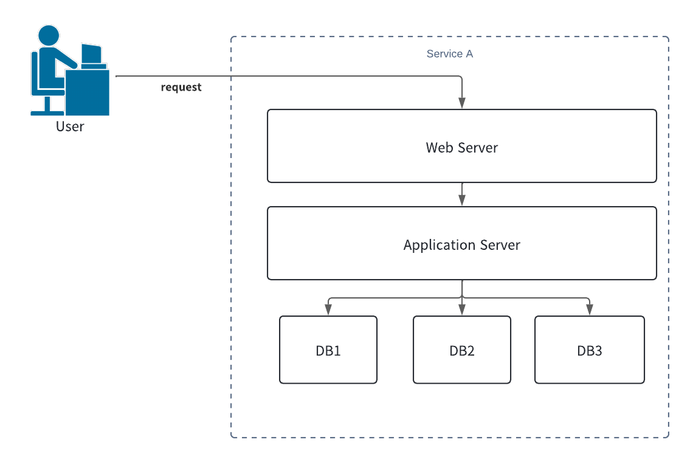
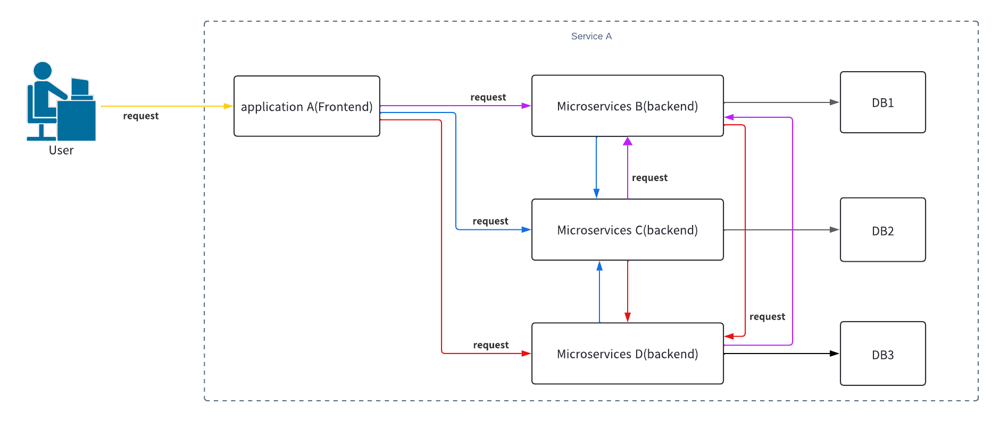
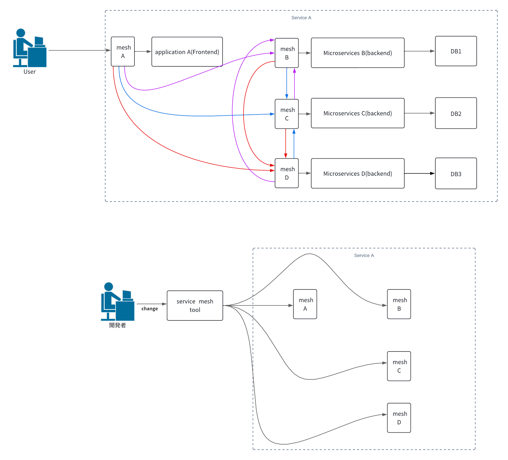

# flexiblemockserverを使ったサービスメッシュツールの検証の仕方

## 目次

- [flexiblemockserverを使ったサービスメッシュツールの検証の仕方](#flexiblemockserverを使ったサービスメッシュツールの検証の仕方)
  - [目次](#目次)
  - [イントロ](#イントロ)
  - [サービスメッシュとは何なのか？](#サービスメッシュとは何なのか)
  - [各サービスメッシュを使った検証](#各サービスメッシュを使った検証)
  - [flexiblemockserverの使い方](#flexiblemockserverの使い方)

## イントロ

このサイトでは、`flexiblemockserver`を使ったサービスメッシュツールの検証方法について紹介します。各サービスメッシュの説明や機能の詳細も簡単に触れますが、詳しくは公式サイトを参考にしてください。

終わりに、`flexiblemockserver`は、私がサービスメッシュツールの検証を進める中で、既存のモックサーバーでは満たされなかったニーズを満たすために自分で実装したツールです。このツールを通じて、皆さんも「こんな機能があったらいいのに」と思うことがあれば、ぜひプルリクエストを送っていただけると嬉しいです。

**（注釈）** これから紹介するサービスメッシュツールや機能の説明は、私が理解している範囲で記載しています。そのため、誤りがある場合もありますので、指摘や修正のプルリクエストをいただけると助かります。

## サービスメッシュとは何なのか？

REDHADのドキュメントによると、サービスメッシュとは以下のような感じで書かれています。

> オープンソース・プロジェクトの Istio を始めとするサービスメッシュは、アプリケーションのさまざまな部分が互いにデータをどのように共有するかを制御する方法です。

[link](https://www.redhat.com/ja/topics/microservices/what-is-a-service-mesh)

自分なりにわかりやすく説明すると、サービスメッシュはマイクロサービスアーキテクチャにおける通信の管理を簡素化し、効率化するための仕組みです。

* マイクロサービス導入前の通信

マイクロサービス導入前は、すべての通信が一つのアプリケーションサーバーを通じて行われ、単一障害点が存在するシンプルな構成です。

* マイクロサービス導入後の通信

図のように、アプリケーションAはB、C、Dに対して通信を行い、BはC、Dに対して、CはB、Dに対して、DはB、Cに対して通信を行います。各アプリケーション間の通信に対して、タイムアウト値などの設定を個別に行う必要がありますが、これは非常に手間がかかります。

* サービスメッシュの導入

この問題を解決するために、サービスメッシュの概念が登場しました。サービスメッシュを導入することで、メッシュサーバーを介したアプリケーション間の通信が実現します。

サービスメッシュを導入すると、タイムアウトやリトライ設定をサービスメッシュツールで一括して管理できるようになります。これにより、全てのメッシュツールに変更が反映され、通信管理が大幅に簡素化されます。

さらに、マイクロサービス化によって各サービスが異なる言語で実装されることが多いですが、サービスメッシュツールを使用すれば、異なる言語で実装されたサービス間でも統一的な通信管理を適用できます。

## 各サービスメッシュを使った検証

* [istio](./istio/README.md) (作成中)
* [Linkerd]() (作成前)
* [Kuma]() (作成前)

## flexiblemockserverの使い方

flexiblemockserverに関しては、READMEをご確認ください。
[link](../README.md)
