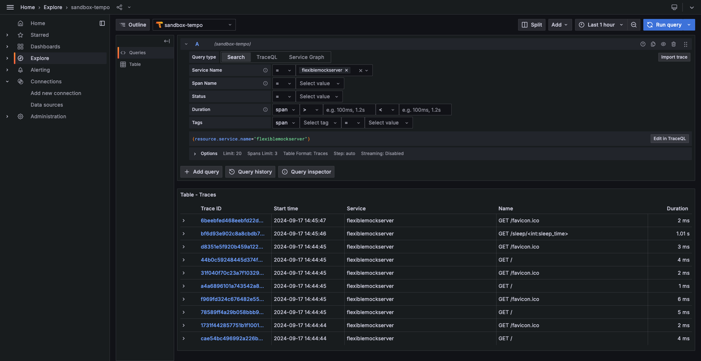
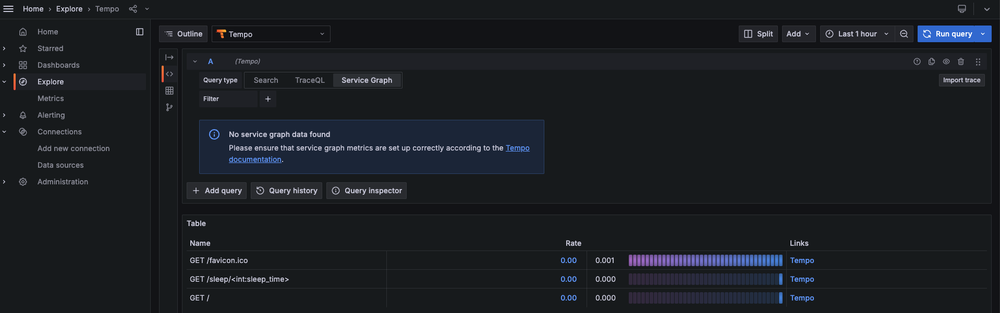

# introduction

This README summarizes how to use grafana tempo with Kubernetes.

> [!NOTE]
> Please Install istio before starting work on this Document.
> <br>ref: [link](../../README.md#istio)

## Step1: GrafanaTempo Install

### 1.1. [cert-manager](https://cert-manager.io/docs/installation/#default-static-install) Install

Execute the following command

```:terminal
❯ kubectl apply -f https://github.com/cert-manager/cert-manager/releases/download/v1.15.3/cert-manager.yaml
```

### 1.2. [GrafanaTempo Operator](https://github.com/grafana/tempo-operator) Install

```:terminal
❯ kubectl apply -f https://github.com/grafana/tempo-operator/releases/latest/download/tempo-operator.yaml
```

### 1.3. [MinIO](https://min.io/)Install

Execute the following command

```:terminal
❯ kubectl apply -f https://raw.githubusercontent.com/grafana/tempo-operator/main/minio.yaml
```

### 1.4. Install TempoCR

Execute the following command

```:terminal
❯ kubectl apply -k sample_manifest/kubernetes/apm_tempo/tempo/
```

## Step2: [OpenTelemetry Controller](https://github.com/open-telemetry/opentelemetry-operator) Install

### 2.1. OpenTelemetry Operator Install

Execute the following command

```:terminal
❯ kubectl apply -f https://github.com/open-telemetry/opentelemetry-operator/releases/latest/download/opentelemetry-operator.yaml
```

### 2.2. Install OpenTelemetry Collector Configuration

Execute the following command

```:terminal
❯ kubectl create ns monitoring
```

```:terminal
❯ kubectl apply -f sample_manifest/kubernetes/apm_tempo/otel-controller/config.yaml
```

## Step4: [Prometheus Operator](https://github.com/prometheus-operator/prometheus-operator) Install

### 4.1. Install Prometheus Operator

Execute the following command

```:terminal
❯ LATEST=$(curl -s https://api.github.com/repos/prometheus-operator/prometheus-operator/releases/latest | jq -cr .tag_name)
curl -sL https://github.com/prometheus-operator/prometheus-operator/releases/download/${LATEST}/bundle.yaml | kubectl create -f -
```

### 4.2. Install Prometheus Controller

```:terminal
❯ kubectl apply -k sample_manifest/kubernetes/apm_tempo/prometheus/
```

## Step4: [Grafana](https://github.com/grafana/grafana) Install

Execute the following command

```:terminal
❯ kubectl apply -k sample_manifest/kubernetes/apm_tempo/grafana
```

## Step5: operation check

Execute the following command

```:terminal
❯ kubectl apply -k sample_manifest/kubernetes/apm_tempo/flexiblemockserver/
```

```:terminal
❯ curl http://localhost:8081/sleep/1 -v
*   Trying [::1]:8081...
* Connected to localhost (::1) port 8081
> GET /sleep/1 HTTP/1.1
> Host: localhost:8081
> User-Agent: curl/8.4.0
> Accept: */*
>
< HTTP/1.1 200 OK
< Server: Werkzeug/3.0.3 Python/3.12.6
< Date: Tue, 17 Sep 2024 05:46:55 GMT
< Content-Type: application/json
< Content-Length: 35
< Connection: close
<
{"sleep_time":1,"status_code":200}
* Closing connection
```

### Grafana trace



### Grafana metric


